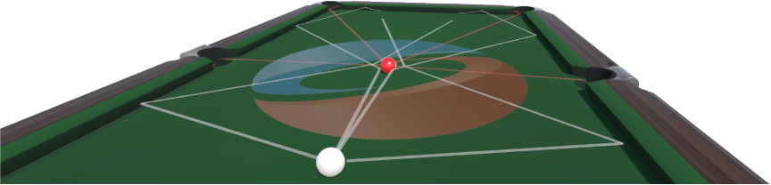
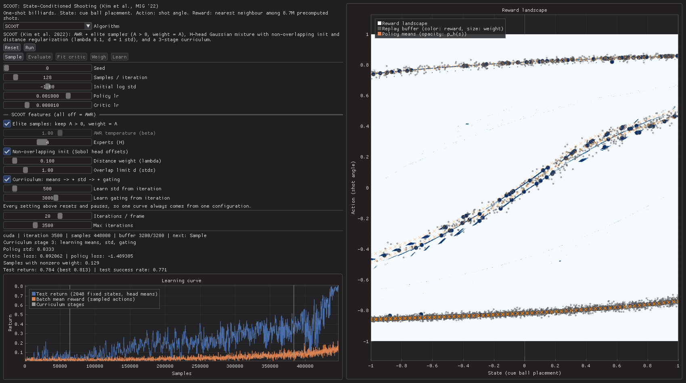

# [MIG '22] Learning High-Risk High-Precision Motion Control

This is the official codebase for https://namheegordonkim.github.io/scoot-mig2022/.



SCOOT (State-Conditioned Shooting) is a deep RL algorithm for high-risk, high-precision control problems, where each action has irreversible consequences and the reward landscape is made of sparse, sharp, multimodal ridges. Billiards is the running example. SCOOT builds on advantage-weighted regression (AWR) and adds three things:

1. **Elite samples.** The policy is fitted only to replay-buffer samples whose advantage is positive, and those advantages are used directly as weights.
2. **Distance-regularized mixture of experts.** The policy is a Gaussian mixture with H heads. The heads start at non-overlapping, space-filling offsets, and a Mahalanobis distance penalty keeps them apart so they cover different reward modes.
3. **Three-stage curriculum.** Only the head means learn at first. The action std joins in the second stage and the mixture weights in the third.

This repository contains a single-file interactive optimizer, `enjoy.py`. It runs SCOOT and the PPO, SAC and AWR baselines on the 1-D billiards problem, where the state is the cue ball placement and the action is the shot angle, and shows every step on top of the reward landscape.

# One-click

```bash
pixi run enjoy
```

This launches the interactive optimizer. On the first run:
- [Pixi](https://pixi.sh) installs the dependencies (Python 3.11, imgui-bundle, PyTorch, NumPy, Matplotlib, gdown).
- `pixi run download` fetches the two data files (about 220 MB) from Google Drive into the repository root. It skips any file that is already there.

A CUDA GPU is used if one is available; otherwise it falls back to the CPU.

| File | Contents |
|---|---|
| [`1s1a_precomputed.pth`](https://drive.google.com/file/d/1SMRuM_Opz9nGkf9LyjUhH3phZzRMH7_6/view) | 8.7M simulated shots (state, action, reward, success), stored as a pickle of NumPy arrays. The environment reward is the nearest neighbour in this table. |
| [`1s1a_landscape.png`](https://drive.google.com/file/d/1m_IVvrED9s-5ZvDjKKL_QtzPovN21vqY/view) | The reward landscape rendered from the same table. It is drawn behind the samples. |

If the automatic download fails, download both files with the links above and put them in the repository root.

# Using the optimizer



The left half has the controls and the learning curve. The right half shows the reward landscape, with state on the x-axis and action on the y-axis; dark blue marks high reward. On the landscape:

- **Circles** are replay-buffer samples. Their color is the observed reward (Blues colormap), and their size is the sample's weight after the Weigh stage.
- **Hollow circles** are new samples that have not been evaluated yet.
- **Orange crosses** are the policy's action means, one per mixture head. Their opacity is the head's probability p_h(s).

Each training iteration runs five stages:

| Stage | What it does |
|---|---|
| **Sample** | Draw 128 states uniformly and sample one action per state from the policy. |
| **Evaluate** | Look up the rewards, add the samples to the replay buffer, and measure the test return: the mean reward of deterministic actions on 2048 fixed test states. |
| **Fit critic** | Regress the value function V(s) (or the twin Q(s, a) critics for SAC) on the observed rewards. Every shot is one-step, so the return equals the reward. |
| **Weigh** | Compute a weight for each sample from its advantage r − V(s). SCOOT keeps only positive advantages; AWR uses exp(A / β); PPO uses normalized advantages. |
| **Learn** | Update the policy by weighted maximum likelihood, plus the distance penalty for SCOOT. PPO uses its clipped surrogate and SAC its entropy-regularized actor loss. |

You can step through one stage at a time with the stage buttons; only the next stage is enabled. **Run** trains continuously. **Iterations / frame** sets the speed. **Max iterations** pauses training automatically.

**Algorithm** selects a method and loads its default settings. AWR and SCOOT share one implementation, so SCOOT's features double as ablation switches:

- elite samples;
- number of experts (H);
- non-overlapping initialization;
- distance weight λ and overlap limit d;
- curriculum, with its stage start iterations.

With every feature off you get plain AWR. Changing any setting resets and pauses the run, so each learning curve comes from a single configuration.

## Defaults

All methods use the same policy network (an MLP with 128 and 64 hidden units, ReLU), tanh-squashed actions, 128 samples per iteration and the same evaluation protocol.

| Method | Settings |
|---|---|
| SCOOT | RAdam, policy lr 1e-3, value lr 1e-5, FIFO buffer of 3200 samples, one epoch of minibatches of 256, H = 4, λ = 0.1, d = 1, curriculum stages start at iterations 500 and 3000, initial log std −1 |
| AWR | Same as SCOOT, but a single Gaussian, weights exp(A / β) with β = 1 on normalized advantages, clipped at 20 |
| PPO | Stable-Baselines3 defaults: Adam 3e-4, clip 0.2, 10 epochs of minibatches of 64, gradient clipping 0.5, on-policy |
| SAC | Stable-Baselines3 defaults: Adam 3e-4, replay buffer of 50k, minibatch 256, one gradient step per sample, automatic entropy temperature |

## Expected results

These are single runs with seed 0 on an RTX 3090. Test return is roughly the shot success rate.

| Method | Iterations (samples) | Final test return | Best test return | Wall time |
|---|---|---|---|---|
| SCOOT | 3500 (448k) | 0.78 | 0.81 | 1.5 min |
| AWR | 3500 (448k) | 0.59 | 0.64 | 4 min |
| PPO | 3500 (448k) | 0.16 | 0.53 | 7 min |
| SAC | 400 (51k) | 0.02 | 0.37 | 6 min |

- PPO locks onto the central ridge and oscillates between peaks.
- SAC keeps its action entropy high and never commits to a ridge.
- SCOOT's experts settle on the separate reward ridges, and its test return jumps once the mixture weights start learning at iteration 3000.

SAC is slow because it takes 128 gradient steps per iteration.

# Citation

```bibtex
@inproceedings{kim2022learning,
  title     = {Learning High-Risk High-Precision Motion Control},
  author    = {Kim, Nam Hee and Kirjonen, Markus and H{\"a}m{\"a}l{\"a}inen, Perttu},
  booktitle = {Proceedings of the 15th ACM SIGGRAPH Conference on Motion, Interaction and Games},
  series    = {MIG '22},
  articleno = {9},
  pages     = {1--10},
  year      = {2022},
  doi       = {10.1145/3561975.3562943}
}
```
